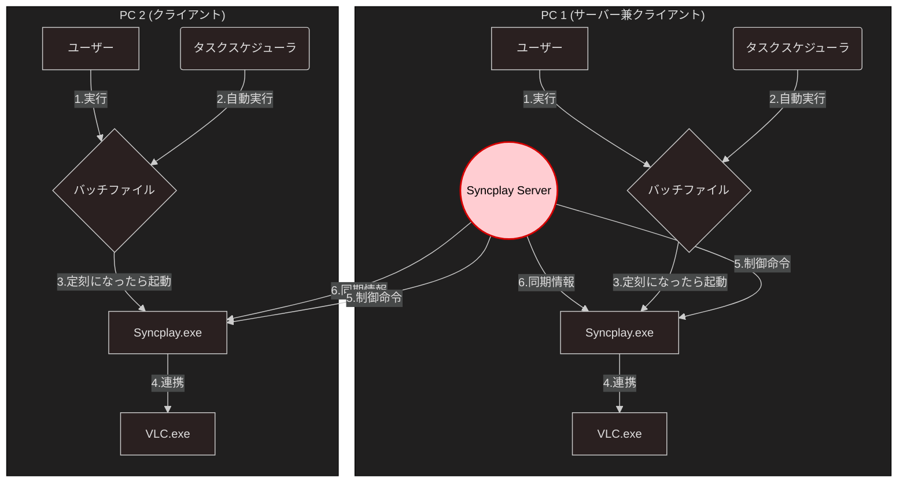

# Syncplay定刻起動システム (with VLC Player)

指定された時刻にSyncplayクライアントを自動起動し、LAN内での同期動画再生を実現するシステムです。

## 概要

このシステムは、複数のPCで動画を同期再生するためのソリューションです。1台のPCがSyncplayサーバーを兼任し、各PCがクライアントとして接続することで、ネットワーク経由で動画の再生位置や再生/停止状態を同期します。

## 動作環境

- **SyncPlay**: v1.7.4 or later
- **VLC Player**: v3.0.21 or later
- **OS**: Windows 10 or 11

## システム構成図

## 処理の流れ

1. **バッチ実行**: 各PCでユーザーが手動、またはタスクスケジューラが自動でバッチファイルを実行します
2. **待機**: 両方のバッチファイルが、それぞれ指定された時刻まで待機します
3. **クライアント起動**: 指定時刻になると、両方のPCでSyncplayクライアント(`syncplayConsole.exe`)が起動します
4. **VLC連携**: Syncplayクライアントは、設定に基づいて自動でVLC (`vlc.exe`)と連携を開始します
5. **同期**: 両方のクライアントがLAN内のSyncplayサーバーに接続し、VLCでの再生位置や再生/停止状態を同期します

## 機能要件

| ID | 要件名 | 詳細 |
|---|---|---|
| FE-01 | **定刻起動機能** | 指定された時刻（時・分）になった際に、Syncplayのクライアント（Syncplay.exe）を起動する |
| FE-02 | **パラメータ設定機能** | バッチファイル内で以下の項目を容易に設定・変更できること ・Syncplayの実行ファイルパス ・起動時刻（HH:MM形式） ・**LAN内SyncplayサーバーのIPアドレス** ・ユーザー名、ルーム名 ・再生する動画ファイルのパス |
| FE-03 | **待機処理機能** | バッチファイルを実行後、指定された時刻になるまで待機状態を維持する |
| FE-04 | **ステータス表示機能** | 待機中である旨をコマンドプロンプト上に表示し、ユーザーが進捗を把握できるようにする |

## 初期設定

この設定は、同期再生を行う**両方のPC**で必要になる箇所と、**サーバーPCのみ**で必要な箇所があります

### ステップ1: 必要なアプリケーションをインストールする

まず使用する全てのPCに以下のアプリケーションをインストールします

- [VLC Media Player](https://images.videolan.org/vlc/index.ja.html)

- [SyncPlay](https://syncplay.pl/download/)

- [Visual Studio Code](https://code.visualstudio.com/download) (※コード修正にオススメですが、必須ではありません)

### ステップ2: ローカルIPアドレスを調べる（サーバーPCのみ）

Syncplayサーバーを立てるPCのIPアドレスを確認します

1. コマンドプロンプトを起動します
2. プロンプト上で `ipconfig` と入力し、自身のIPアドレスを確認します
3. 別機のコマンドプロンプトからそれぞれ`ping <Server IP>`を入力し、互いに通信が出来ているかを確認します
4. Pingが返ってこない場合はファイアウォールなどの設定を見直してください

### ステップ3: 本サービスのインストール + 動画ファイルを準備する（両方のPCで実施）

本サービスをダウンロードし、任意の場所に解凍してください

オススメは`\document\SyncPlay_AutoTimer`です

基本的に動画は`\Video`に設置してください (※連携スクリプト内でパスの変更が可能です)

### ステップ4: Syncplayサーバーを起動する（サーバーPCのみ）

次に、サーバーPCでSyncplayサーバープログラムを起動します。

1. Syncplayのインストールフォルダ（例: `C:\Program Files\Syncplay`）を開きます
2. `syncplay-server.exe` というファイルを見つけて、ダブルクリックで実行します
3. 「Windowsセキュリティの重要な警告」というファイアウォールの許可画面が表示されたら、**「プライベートネットワーク」にチェックが入っていることを確認**し、「アクセスを許可する」をクリックします
4. サーバー用の黒いウィンドウが起動すれば成功です

### ステップ5: Syncplayの起動設定（両方のPCで実施）

インストールした本サービスの`\Script\main.ps1`を開き、それぞれの起動変数や動作モードを設定します

- **SyncplayPath** : `SyncplayConsole.exe`のインストールされているフォルダパスを入力します。デフォルトは`C:\Program Files (x86)\Syncplay\SyncplayConsole.exe`です
- **SyncplayServerPath** : `syncplayServer.exr`のインストールされているフォルダパスを入力します。デフォルトは`C:\Program Files (x86)\Syncplay\syncplayServer.exe`です
- **PlayerPath** : VLC Media Playerがインストールされているフォルダパスを入力します。デフォルトは`C:\Program Files\VideoLAN\VLC\vlc.exe`です
- **ServerIP** : ステップ2で調べたサーバIPを入力します。
- **ServerPort** : Syncplayが動作するポートを入力します。デフォルトは`8999`です
- **UserName** : Syncplayのルームに入室する際の名前を入力します。
- **RoomName** : Syncplayのルーム名を入力します。必ず使用する全てのPCで同じ名前に設定してください
- **RoomPassword** : Syncplayのルームパスワードを入力します。必須項目ではありません。
- **VideoFilePath** : 再生する動画のパスを入力します。(※相対パスでの入力をオススメします)
- **TargetTimes** : 動画を再生する時間を入力します。必ず`@("HH:MM", "HH:MM", ...)`の書式で設定してください
- **ServerMode** : サーバ機のみONにするモードです
- **AutoStopMode** : 一定時間を経過した場合に動画を自動停止するモードです。基本的にはどのPCでもONにします
- **DebugMode** : デバッグ用のモードです
- **MinimizeStartMode** : コンソール画面を最小化するモードです。基本的にはどのPCでもONにします
- **AutoStopMinutes** : `AutoStopMode`がONの場合に、再生を継続する時間を入力します
- **AutoPlayDelay** : SyncplayとVLCが起動した瞬間から動画再生がされるまでの時間を入力します (必ず2秒以上に設定してください)

### ステップ6: VLC Media Playerの表示設定（オプション）

動画再生を自然に行うためにVLC Media Playerで以下の設定を行うことをオススメします

1. VLC Media Playerを立ち上げ、画面上部の「ツール(S) → 設定(P)」をクリックします
2. 「ビデオ → ディスプレイ」から**全画面表示**をONにします
3. 「字幕/OSD → オンスクリーンディスプレイ(OSD)」から**オンスクリーンディスプレイ(OSD)を有効化**と**字幕の有効化**をOFFにします

## 使用方法

初期設定完了後は、以下の手順で同期再生を開始できます：

1. 各PCで`\Script\run.bat`を実行 (Windowsタスクスケジューラーなどで自動起動するように設定してください)
2. 実行後、自動でSyncplayサーバが起動します
3. 指定時刻まで待機
4. 指定時刻に自動でSyncplayクライアントが起動し、同期再生が開始されます
5. 指定時間を過ぎると自動でビデオ再生アプリが停止します

## トラブルシューティング

- ファイアウォールでSyncplayの通信が遮断されていないか確認してください
- 両PCが同じネットワーク（LAN）に接続されていることを確認してください
- 動画ファイルが両PCで同じパス・同じファイルサイズであることを確認してください

## ライセンス

このプロジェクトで使用している外部ソフトウェアのライセンスに従ってください：
- Syncplay: Apache License 2.0
- VLC Media Player: GNU General Public License v2.0
